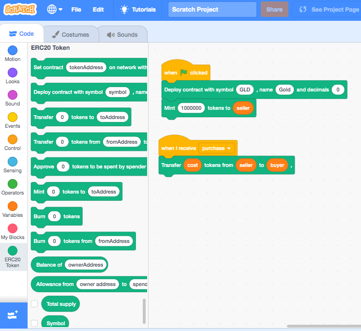

# eth-scratch3

> a Scratch 3.0 extension for interacting with Ethereum contracts.


# Quick Start

The easiest way to play with the Scratch 3 extensions for Ethereum contracts is to run the Scratch server locally on a [Docker](https://www.docker.com/) container.
```bash
mkdir scratch
cd scratch
git clone https://github.com/naddison36/eth-scratch3.git
cd eth-scratch3
npm install
docker build -t eth-scratch3 --target web .
docker run -p 8601:8601 -e PORT=8601 eth-scratch3
```

After the server starts, Scratch should be available at [http://localhost:8601](http://localhost:8601)

To load an extension, click the `Add Extension` button on the bottom left of the Scratch UI.


## Table of Contents

- [Scratch](#scratch)
  * [What is Scratch?](#what-is-scratch)
  * [Scratch 3.0](#scratch-30)
  * [Scratch 3.0 Extensions](#scratch-30-extensions)
  * [Hacking Scratch 3.0 Extensions](#hacking-scratch-30-extensions)
  * [Scratch 3.0 Extension Development](#scratch-30-extension-development)
    + [Prerequisite](#prerequisite)
    + [Installation](#installation)
    + [Customization](#customization)
- [Ethereum](#ethereum)
  * [Smart Contracts](#smart-contracts)
  * [MetaMask](#metamask)
- [Testing](#testing)
- [Docker](#docker)
- [Continuous Integration](#continuous-integration)

# Scratch

## What is Scratch?
[Scratch](https://scratch.mit.edu/) is a project of the Lifelong [Kindergarten Group](https://www.media.mit.edu/groups/lifelong-kindergarten/overview/) at the [MIT Media Lab](https://www.media.mit.edu/). It is provided free of charge.

Scratch is designed especially for ages 8 to 16, but is used by people of all ages. Millions of people are creating Scratch projects in a wide variety of settings, including homes, schools, museums, libraries, and community centers.

## Scratch 3.0
[Scratch 3.0](https://scratch.mit.edu/info/faq#scratch3) is the latest generation of Scratch, launched on January 2, 2019. It is designed to expand how, what, and where you can create with Scratch. It includes dozens of new sprites, a totally new sound editor, and many new programming blocks. And with Scratch 3.0, you’re able to create and play projects on your tablet, in addition to your laptop or desktop computer.

## Scratch 3.0 Extensions
In the Scratch editor, you can add collections of extra blocks called [extensions](https://scratch.mit.edu/info/faq#scratch-extensions).

The Scratch Team will be publishing specifications and guidelines for extensions in the future. Once available, you will be able to submit extensions to the Scratch Team for consideration in the official Scratch 3.0 extensions library. We’ll also provide guidelines for developing and distributing "experimental" extensions, which can be used to create projects on individual computers, but not shared in the Scratch online community.

## Hacking Scratch 3.0 Extensions
Although Scratch extension specifications have not been released, a few people in the community have worked out how to hack together a Scratch 3.0 extension. Most of the work in this repository is based off the blog post [How to Develop Your Own Block for Scratch 3.0](https://medium.com/@hiroyuki.osaki/how-to-develop-your-own-block-for-scratch-3-0-1b5892026421).

An example Scratch game [Scratch Wars](https://scratch.mit.edu/projects/95284179/).

For more Scratch information, see the [Scratch FAQ](https://scratch.mit.edu/info/faq).

## Scratch 3.0 Extension Development

### Prerequisite 

The following software must be installed before running the installation steps
- [Git](https://git-scm.com/downloads)
- [Node.js](https://nodejs.org/en/download/)
- [Docker](https://docs.docker.com/docker-for-mac/install/)

### Installation

The following will install this [Eth Scratch 3](https://github.com/naddison36/eth-scratch3) repository and the Scratch repositories [scratch-gui](https://github.com/LLK/scratch-gui) and [scratch-vm](https://github.com/LLK/scratch-vm). This will allow Scratch with the custom extensions to be run locally.
```bash
mkdir scratch
cd scratch
git clone https://github.com/naddison36/eth-scratch3.git
cd eth-scratch3
npm install

# install the scratch gui and vm packages
cd ../..
git clone https://github.com/LLK/scratch-gui.git
cd scratch-gui
npm install
cd ..
git clone https://github.com/LLK/scratch-vm.git
cd scratch-vm
npm install
npm link
cd ../scratch-gui
npm link scratch-vm

# link crypto beasts to the scratch vm extensions
cd ../scratch-vm/src/extensions
ln -s ../../../eth-scratch3/scratch/extensions ./custom
# Link the extension to Truffle's deployed contract information
cd ../../../eth-scratch3/scratch/extensions/
ln -s ../../build/contracts contracts

# Copy modified scratch vm and gui files into the dependent packages
cd ../
cp gui/index.jsx ../../scratch-gui/src/lib/libraries/extensions/index.jsx
cp vm/extension-manager.js ../../scratch-vm/src/extension-support/extension-manager.js

# start the Scratch React App
cd ../../scratch-gui
npm start
```

After the server starts, Scratch should be available at [http://localhost:8601](http://localhost:8601) 

### Customization

The following steps are done in the above but a listed here for anyone who wants to write their own Scratch extension.

New extensions are registered in the scratch-gui project in the `src/lib/libraries/extensions/index.jsx` file. Add this to the `extensions` array
```js
{
    name: (
        <FormattedMessage
            defaultMessage="Detailed, mintable, burnable token"
            description="Name of extension"
            id="gui.extension.erc20.name"
        />
    ),
    extensionId: 'tokenDetailedMintableBurnable',
    collaborator: 'Nick Addison',
    // iconURL: boostIconURL,
    // insetIconURL: boostInsetIconURL,
    description: (
        <FormattedMessage
            defaultMessage="A detailed ERC20 token that is mintable and burnable"
            description="Description of extension"
            id="gui.extension.erc20.description"
        />
    ),
    featured: true,
    disabled: false,
    bluetoothRequired: false,
    internetConnectionRequired: true
},
```

The JavaScript in the extension file needs to be loaded via the `src/extension-support/extension-manager.js` file in the `scratch-vm` package. Add the following function property to the `builtinExtensions` object in the `src/extension-support/extension-manager.js` file
```js
tokenDetailedMintableBurnable: () => require('../extensions/custom/tokenDetailedMintableBurnable'),
```

# Ethereum

In order to deploy the contracts with the public test networks using [Truffle](https://truffleframework.com), the [config.js](./config.js) file needs to be updated with your private key and [Infura](https://infura.io) project id. See [Introducing the Infura Dashboard](https://blog.infura.io/introducing-the-infura-dashboard-8969b7ab94e7) for details on how to get an Infura project id.

To deploy the token contract to the Ropsten public test network.
```bash
truffle deploy --reset --network ropsten
```

## Smart Contracts

The contracts used by the Scratch extensions are based off [Open Zeppelin](https://docs.openzeppelin.org/) contract.
* [TokenDetailedMintableBurnable](./contracts/TokenDetailedMintableBurnable.sol) is a [detailed](https://github.com/OpenZeppelin/openzeppelin-solidity/blob/master/contracts/token/ERC20/ERC20Detailed.sol) Open Zeppelin [token contract](https://github.com/OpenZeppelin/openzeppelin-solidity/blob/master/contracts/token/ERC20/ERC20.sol) that is [Mintable](https://github.com/OpenZeppelin/openzeppelin-solidity/blob/master/contracts/token/ERC20/ERC20Mintable.sol) and [Burnable](https://github.com/OpenZeppelin/openzeppelin-solidity/blob/master/contracts/token/ERC20/ERC20Burnable.sol). This means tokens can be added by the minter or can be burnt by the token owner.

## MetaMask

[MetaMask](https://metamask.io/) is a browser extension that allows users to manage their Ethereum private keys in a variety of ways, including hardware wallets, while isolating them from the site context. MetaMask comes pre-loaded connections to Ethereum main and test networks via [Infura](https://infura.io/).

See [MetaMask Developer Documentation](https://metamask.github.io/metamask-docs/) for more details on how to 

# Testing

[Jest](https://jestjs.io/) tests are used to test the Scratch extensions.

`npm run test` will run the Jest tests. This runs from the test script in the package.json
```bash
./node_modules/.bin/jest --forceExit --detectOpenHandles --runInBand
```

To run a particular test, use the `-t` option. eg
```bash
./node_modules/.bin/jest --forceExit --detectOpenHandles --runInBand -t TokenDetailedMintableBurnable
```

If npx is installed globally, the tests can also be run by
```bash
npx --forceExit --detectOpenHandles --runInBand
```

# Docker

This [Dockerfile](./Dockerfile) will add the [ERC20](./scratch/extensions/erc20/index.js) as a built in extension, build the Scratch 3.0 react app and copy it into a nginx image. This can then be deployed to a cloud provider. This project is currently using Heroku, but others like AWS, Azure and GCP will also work.

`npm run buildWebImage` will build the Docker image which runs
```
docker build -t registry.heroku.com/eth-scratch3-prod/web:latest --target web .
```

`npm run bashWebImage` will shell into the build image which runs
```
docker run -it registry.heroku.com/eth-scratch3-prod/web:latest sh
```

`npm run runWebImage` will run the Scratch 3.0 react app locally
```
docker run -p 8601:8601 -e PORT=8601 registry.heroku.com/eth-scratch3-prod/web:latest
```

This project is deploying to Heroku hence the `registry.heroku.com/eth-scratch3-prod` image names. These will need to be changed if deploying to other cloud based Container Registries.

# Continuous Integration

[CicleCi](https://circleci.com/) is used for CI. The config file is [.circleci/config.yml](.circleci/config.yml).
