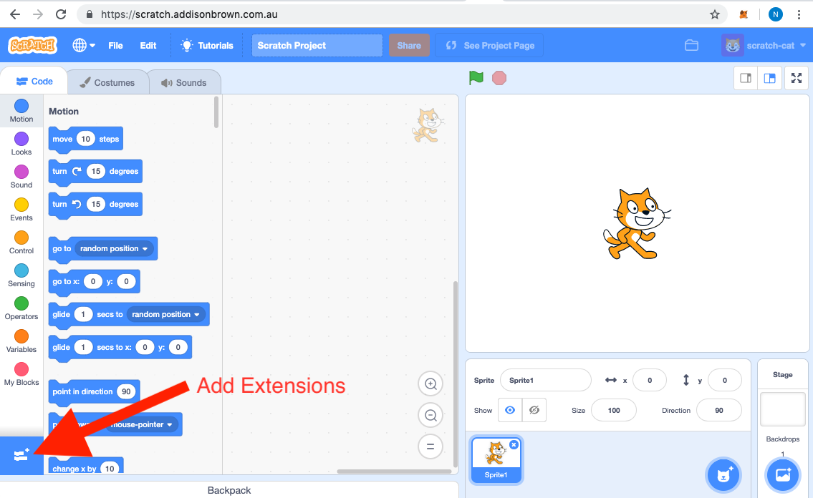
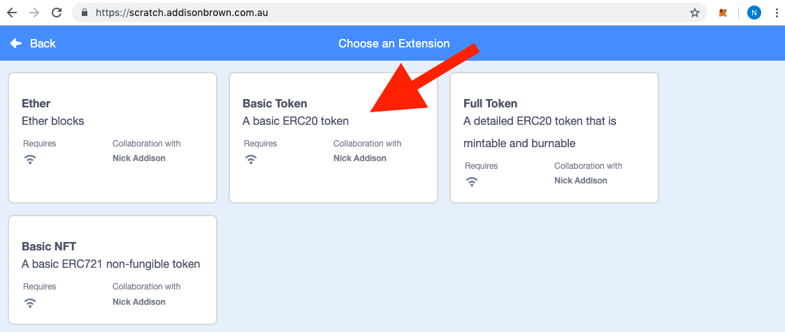
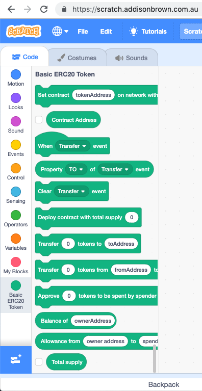
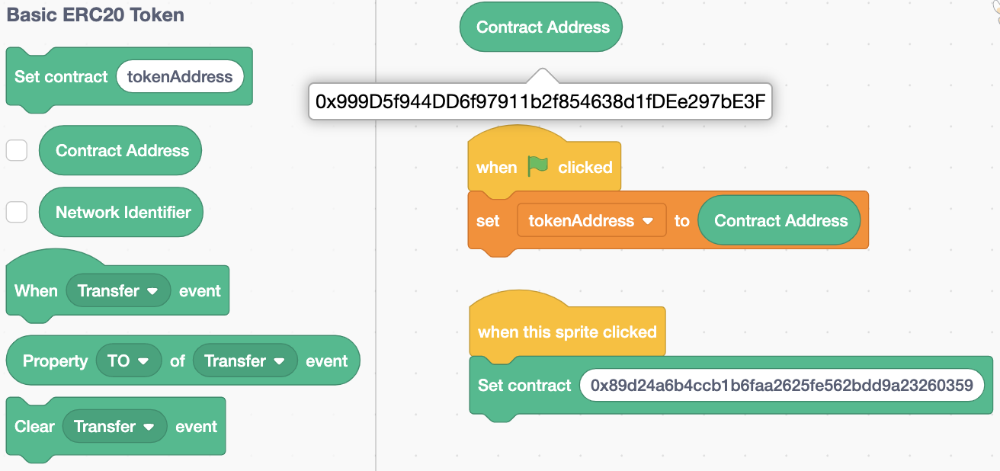
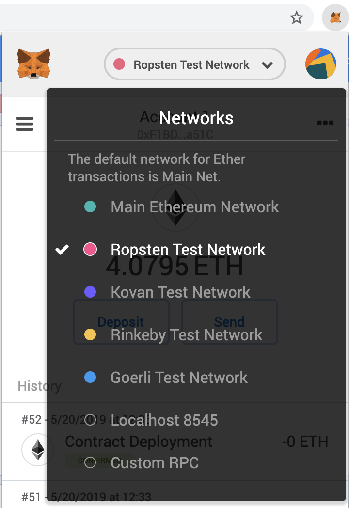
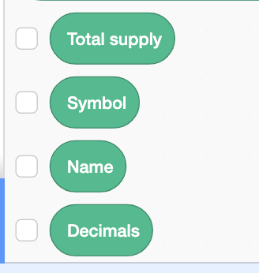
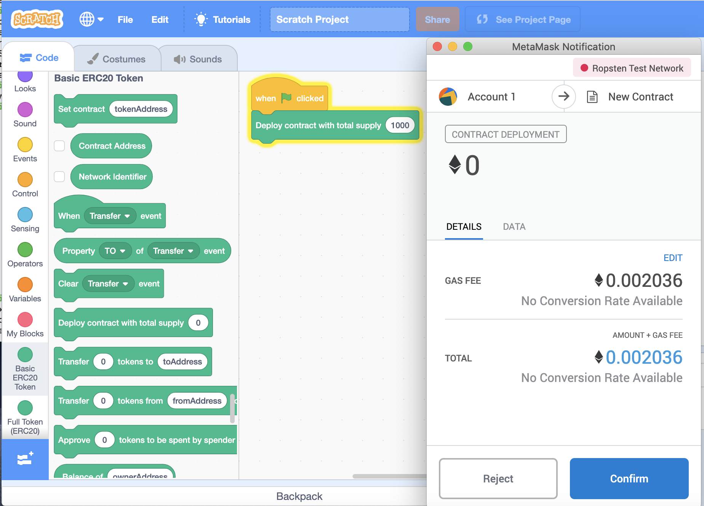
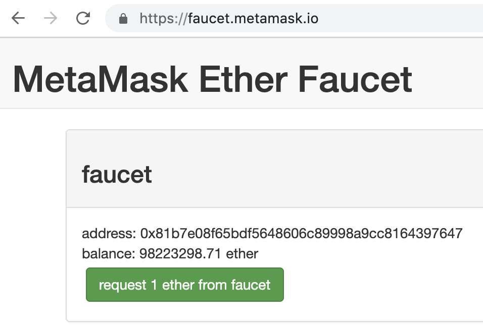

# Scratch Token Extension Guide

This tutorial will guide you through interacting with an Ethereum token contract using the Scratch language. This includes reading state data from a contract, sending transactions that are signed by the MetaMask wallet, deploying new contracts and processing contract events.

To avoid any confusion, the Scratch extensions do not replace developing contract using the [Solidity](https://solidity.readthedocs.io) or [Vyper](https://vyper.readthedocs.io) contract languages. The extensions are just a tool to make programmatic interactions with Ethereum contracts easier.

# Background

You can skip this background section if you already know about Scratch and Ethereum.

## Scratch

[Scratch](https://scratch.mit.edu/) is designed to teach kids how to program using graphical blocks that clip together. This provides a much simpler syntax that kids and adults can learn to make animations, stories and games. See the [Scratch FAQ](https://scratch.mit.edu/info/faq) or the [Scratch Tutorials](https://scratch.mit.edu/projects/editor/?tutorial=all) to learn more about programming Scratch.

### Scratch 3.0

Scratch 3.0 is the latest generation of Scratch launched on January 2, 2019. It replaces the old Scratch versions that relied on [Adobe Flash Player](https://www.adobe.com/products/flashplayer.html). Scratch 3.0 builds on Google's [Blockly](https://developers.google.com/blockly/) technology to make Scratch available on mobile devices along with many other improvements. See the [Scratch 3.0 wiki](https://en.scratch-wiki.info/wiki/Scratch_3.0) for more details on what's new in Scratch 3.0. 

### Scratch Extensions

Scratch 3.0 introduces [extensions](https://scratch.mit.edu/info/faq#scratch-extensions) which allow developers to add custom blocks that can interact with physical devices or internet services. Although the Scratch team is still to publish the specifications and guidelines for extensions, the [Scratch code](https://github.com/LLK/scratch-www) is open-sourced so it's possible to deploy Scratch extensions to a separately hosted Scratch environment.

### Block Shapes

The block shapes used in the Scratch extensions are
* [Reporter](https://en.scratch-wiki.info/wiki/Reporter_Block) - are rounded blocks that return number or string values
* [Stack](https://en.scratch-wiki.info/wiki/Stack_Block) - have a notch at the top and a bump on the bottom so they can be stacked together. Each block performs a command.
* [Hat](https://en.scratch-wiki.info/wiki/Hat_Block) - have a rounded top and a bump at the bottom. They are used to start executing a stack of command blocks.

## Ethereum

[Ethereum](https://www.ethereum.org/) is a global, open-source platform for decentralized applications. See [Ethereum for Beginners](https://www.ethereum.org/beginners/) or [Learn about Ethereum](https://www.ethereum.org/learn/) for more information on what Ethereum is.

For this guide, we'll be interacting with an Ethereum contract that complies with the [ERC-20 token standard](https://en.wikipedia.org/wiki/ERC-20). A token represents something of value and is owned by an Ethereum account. An Ethereum account can be controlled by a user's wallet, or it could be another Ethereum contract.

For this tutorial, we'll be using the [MetaMask](https://metamask.io/) wallet which is a Chrome, Firefox or Opera  browser add-on. See [How To Use MetaMask](https://youtu.be/ZIGUC9JAAw8) video for installation instructions.

We'll be using the Ropsten Ethereum test network in the tutorial so in MetaMask make sure your Network is set to `Ropsten Test Network`. You can use [Etherscan](https://ropsten.etherscan.io/) to view the contracts and transactions on the Ropsten test network.

The ERC20 contract in the Basic Token extension is an [Open Zeppelin](https://openzeppelin.org/) ERC20 contract. The Solidity source code is [here](https://github.com/naddison36/eth-scratch3/blob/master/contracts/TokenBasic.sol) for those that are interested, but it's not needed for the tutorial. The Basic Token extension defaults to pointing to the contract with address [0x999D5f944DD6f97911b2f854638d1fDEe297bE3F](https://ropsten.etherscan.io/address/0x999D5f944DD6f97911b2f854638d1fDEe297bE3F) on the Ropsten network.

# Contract Extension Blocks

For this tutorial, we'll be using the Scratch editor at https://scratch.addisonbrown.com.au/ rather than the official [Scratch editor from MIT](https://scratch.mit.edu/projects/editor/). This is because the official Scratch editor does not yet allow custom Scratch extensions to be loaded.

The Scratch app has a large JavaScript file so please be patient while it downloads with a blank white screen. Yes, it's not a great user experience but hacking the Scratch React app to fix this is beyond my frontend skills.

## Loading contract extensions

Click the blue Add Extension button at the bottom left of the screen to see the custom extensions.

For this tutorial, we'll choose the `Basic Token` extension

This will load the `Basic ERC20 Token` blocks

The first extension you load will ask you to connect your MetaMask wallet to the Scratch application. MetaMask is required for sending signed transactions to the Ethereum network. If you reject this request you can still read data from contracts but you will not be able to send any transactions.

## Contract Address

You can check what contract address the extension is pointing to by using the `Contract Address` reporter block. Reporter blocks in Scratch are rounded blocks and return a value. These can be manually invoked by double-clicking the block, or by including the reporter block in a stack of command blocks. The `Contract Address` block in the below example is after it has been manually invoked by double-clicking the block.

The blocks in the middle of the examples are a common pattern for setting a Scratch variable to the value returned from a reporter block. In this example, the custom variable tokenAddress is set when the scratch game starts.

The last example sets the contract address of the extension to the already deployed DAI contract [0x89d24a6b4ccb1b6faa2625fe562bdd9a23260359](https://etherscan.io/token/0x89d24a6b4ccb1b6faa2625fe562bdd9a23260359) when the scratch sprite is clicked. The contract address has to be in hexadecimal format with a `0x` prefix.

## Network Identifier

The value of the `Network Identifier` reporter block comes from which network your MetaMask wallet is pointing to. For example, Ropsten has network id 3 and mainnet is 1. See [list of network ids](https://ethereum.stackexchange.com/a/17101) for more.

By default, the contract address of the token extension points to [0x999D5f944DD6f97911b2f854638d1fDEe297bE3F](https://ropsten.etherscan.io/address/0x999D5f944DD6f97911b2f854638d1fDEe297bE3F) on the Ropsten test network. Reading data or sending transactions to this address on other networks will fail.

## Reading data from a contract

The `Basic Token` only has one reporter block in the `Total Supply` block that reads data from a token contract. The `Full Token` extension has a few more in `Symbol`, `Name` and `Decimals` as shown below.

These reporter blocks use web3 provider injected by the MetaMask wallet to connect to [Infura](https://infura.io/) API. The Infura API then connect to the public Ethereum networks to call the read-only functions on the token contracts.

## Deploying a token contract

Rather than using an existing token contract, it is possible to deploy a new token contract using the Scratch extensions. As contract deployments require a signed transaction, MetaMask will be used to sign the Ethereum transaction using the private key of the user.

Below is an example of deploying the basic token contract with the Scratch project is started. In the example, it will mint 1000 tokens to the account that deploys the contract.

When the deploy command block is called, the MetaMask confirmation window will appear for the user to confirm the transaction. The account used to sign the transaction is whatever the selected MetaMask account is.

As we are sending an Ethereum transaction, the sending account needs to have enough Ether to pay for the transaction. Ether for the Ropsten network can be requested using the [MetaMask faucet](https://faucet.metamask.io/)

Unlike other transactions, the deploy contract transaction will not continue executing the commands in the block stack until the transaction has been mined. Other transactions will continue once the transaction hash has been returned.

## Transferring Tokens

WIP

## Processing contract events

WIP

## Debugging

WIP